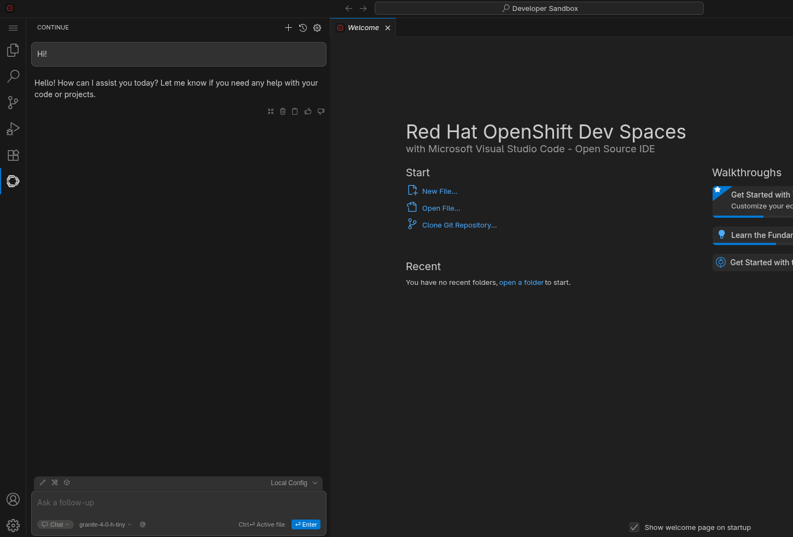

# Red Hat Dev Spaces extended with AI

Red Hat OpenShift Dev Spaces workspace with the [Continue](https://continue.dev) AI assistant pre-installed.

The following extensions are included:

* [Continue](https://www.continue.dev/) – AI assistant
* [Roo Code](https://marketplace.visualstudio.com/items?itemName=RooVeterinaryInc.roo-cline) (Roo AI) – AI-powered coding with agents
* [Red Hat Migration Toolkit for Applications](https://marketplace.visualstudio.com/items?itemName=redhat.mta-vscode-extension) (MTA) – Analyze, assess, and migrate application source code

## What's included

- **devfile.yaml** – Dev Space definition with VS Code, adding extension.
- **.vscode/extensions.json** – Declare extensions to install: Continue, Roo Code (Roo AI), Red Hat MTA.
- **.continue/config.yaml** – Continue configuration template (models only).
- **.continue/mcpServers/mcp.json** – Standard MCP server definition (same format as Cursor/Claude). Uses `CONTEXT7_API_KEY` for the Context7 API key; set it in your Secret to enable Context7 (used in **agent mode**). The postStart command copies the full `.continue` folder to `~/.continue/` and substitutes all placeholders from the workspace Secret.

## Environment variables in the workstation

When a workspace is created from this `devfile`, the following environment variables are available inside
the containers (e.g. in the terminal and to commands/scripts).

### Reserved variables (set by the devfile / Dev Workspace runtime)

These are defined by the [devfile specification](https://devfile.io/docs/2.2.0/defining-environment-variables) 
and **cannot be overridden** in the devfile `env` section.
They are set automatically in every container that has `mountSources: true`:

| Variable           | Description |
|--------------------|-------------|
| **`PROJECTS_ROOT`** | Path where project sources are mounted. Defined by the container’s `sourceMapping`; default is **`/projects`**. Use this in commands and scripts to refer to the root of cloned projects. |
| **`PROJECT_SOURCE`** | Path to the **first** project’s source directory. Equals `$PROJECTS_ROOT/<project-name>`. With a single project, this is typically `/projects/<repo-name>`. |

You can use `$PROJECTS_ROOT` and `$PROJECT_SOURCE` in devfile **commandLine** and **workingDir** (e.g. in `postStart` commands).

### Custom Variables defined

Continue is configured using environment variables provided via an OpenShift Secret mounted
into the Dev Space workstation.

| Variable                   | Description |
|----------------------------|-------------|
| **`CONTINUE_MODEL_NAME`**  | Model name for Continue. Substituted into the copied config. |
| **`CONTINUE_MODEL_API_URL`** | Model API base URL (e.g. `https://.../v1`). Substituted into `apiBase` in the copied Continue config. |
| **`CONTINUE_MODEL_API_KEY`** | Model API key for Continue. Substituted into the copied config. |
| **`CONTEXT7_API_KEY`**     | *(Optional)* API key for the [Context7](https://context7.com) MCP server. If set, the Context7 MCP server is enabled in Continue (agent mode) for up-to-date code documentation. |

### Variables from Secrets and ConfigMaps

Any Kubernetes Secret or ConfigMap that you mount into the Dev Workspace with **`controller.devfile.io/mount-as=env`**
adds its keys as environment variable names and their values. This devfile is set up to use a Secret named **`user-devspaces-secrets`** (see below) with keys **`CONTINUE_MODEL_NAME`**, **`CONTINUE_MODEL_API_URL`**, and **`CONTINUE_MODEL_API_KEY`**; optionally **`CONTEXT7_API_KEY`** for the Context7 MCP server. You can add any other keys to the same Secret for other extensions or tools.

### Other environment variables

- **Standard container env**: The image and the platform set common variables such as `HOME` (e.g. `/home/user`), `USER`, `PATH`, etc.
- **Implementation-specific**: Red Hat Dev Spaces may inject additional variables (e.g. workspace or user identifiers). For an authoritative list for your version, see the [Dev Spaces documentation](https://docs.redhat.com/en/documentation/red_hat_openshift_dev_spaces/) or the [devfile API schema](https://devfile.io/docs/2.2.0/devfile-schema).

To inspect variables at runtime, run `env` or `printenv` in a terminal inside the workspace.

## Setting the API key and API URL as environment variables

The devfile expects environment variables provided by a **Kubernetes Secret** named `user-devspaces-secrets` (or any name you choose), mounted as env. The postStart command copies the **entire** `.continue` folder (including `config.yaml` and `mcpServers/mcp.json`) to `~/.continue/` and replaces placeholders with these variables.

### Variables for Continue models

- **`CONTINUE_MODEL_NAME`** – Model name for Continue.
- **`CONTINUE_MODEL_API_URL`** – Model API base URL (e.g. `https://llama-3-2-3b-maas-apicast-production.apps.prod.rhoai.rh-aiservices-bu.com:443/v1`). Written into `~/.continue/config.yaml` as `apiBase`.
- **`CONTINUE_MODEL_API_KEY`** – Model API key for Continue. Written into `~/.continue/config.yaml`.

### Variable for Context7 MCP server

The file `.continue/mcpServers/mcp.json` declares the Context7 MCP server and uses the **`CONTEXT7_API_KEY`** environment variable for the API key (see [Context7 API keys](https://context7.com/docs/howto/api-keys)). To enable Context7 in Continue (agent mode), add this variable to the same Secret:

- **`CONTEXT7_API_KEY`** *(optional)* – API key for the Context7 MCP server. Create a key at [context7.com/dashboard](https://context7.com/dashboard). If set, the postStart command substitutes it into `~/.continue/mcpServers/mcp.json` when copying the `.continue` folder.

### Creating and mounting the Secret

Create a Secret named **`user-devspaces-secrets`** (or another name) in your **user namespace**, and mount it with the labels and annotation
below so these variables are available in the workstation. You can add any other keys you need for extensions or tools; each key becomes an environment variable. The postStart command then
copies the full `.continue` folder to `~/.continue/` and replaces all placeholders (Continue model vars and `CONTEXT7_API_KEY`).

### Prerequisites

- Access to the OpenShift cluster where Dev Spaces is running.
- Your Dev Spaces user namespace (e.g. `https://<devspaces-host>/api/kubernetes/namespace`).
- `oc` logged in with permissions to create resources in that namespace.

### Step 1: Create a Secret

Create a Secret in your **user namespace** with keys that match the devfile and the
Continue/MCP config templates. Include the three Continue model keys; add `CONTEXT7_API_KEY` to enable the Context7 MCP server.

**Option A – Using `oc` (recommended)**

```bash
# Replace <your-namespace> with your Dev Spaces user namespace
# Replace <your-api-key> with your actual API key
# Replace <your-api-url> with your model API base URL (e.g. https://.../v1)
oc create secret generic user-devspaces-secrets \
  --from-literal=CONTINUE_MODEL_NAME='<your-model-name>' \
  --from-literal=CONTINUE_MODEL_API_URL='<your-api-url>' \
  --from-literal=CONTINUE_MODEL_API_KEY='<your-api-key>' \
  -n <your-namespace>
```

Example with a Red Hat OpenShift AI (RHOAI) endpoint (optionally add Context7 for MCP):

```bash
oc create secret generic user-devspaces-secrets \
  --from-literal=CONTINUE_MODEL_NAME='llama-3-2-3b' \
  --from-literal=CONTINUE_MODEL_API_URL='https://llama-3-2-3b-maas-apicast-production.apps.prod.rhoai.rh-aiservices-bu.com:443/v1' \
  --from-literal=CONTINUE_MODEL_API_KEY='<your-api-key>' \
  --from-literal=CONTEXT7_API_KEY='<your-context7-api-key>' \
  -n <your-namespace>
```

**Option B – Using a manifest**

1. Encode each value in Base64 (no trailing newline):

   ```bash
   echo -n '<your-model-name>' | base64
   echo -n '<your-api-url>' | base64
   echo -n '<your-api-key>' | base64
   # Optional, for Context7 MCP:
   echo -n '<your-context7-api-key>' | base64
   ```

2. Create a file (e.g. `user-devspaces-secrets.yaml`) and apply it in your user namespace:

   ```yaml
   apiVersion: v1
   kind: Secret
   metadata:
     name: user-devspaces-secrets
   type: Opaque
   data:
     CONTINUE_MODEL_NAME: <base64-encoded-model-name>
     CONTINUE_MODEL_API_URL: <base64-encoded-api-url>
     CONTINUE_MODEL_API_KEY: <base64-encoded-api-key>
     # Optional – Context7 MCP server (substituted into .continue/mcpServers/mcp.json):
     # CONTEXT7_API_KEY: <base64-encoded-context7-api-key>
   ```

   ```bash
   oc apply -f user-devspaces-secrets.yaml -n <your-namespace>
   ```

### Step 2: Mount the Secret as environment variables

Add the required labels and the `mount-as: env` annotation so the Secret is mounted
as environment variables in all Dev Workspace containers:

```bash
oc label secret user-devspaces-secrets \
  controller.devfile.io/mount-to-devworkspace=true \
  controller.devfile.io/watch-secret=true \
  -n <your-namespace>

oc annotate secret user-devspaces-secrets \
  controller.devfile.io/mount-as=env \
  -n <your-namespace>
```

- **mount-to-devworkspace=true** – Mounts the Secret into your Dev Workspace.
- **watch-secret=true** – Changes are picked up when you restart the workspace.
- **mount-as=env** – Each Secret key becomes an environment variable (key name = variable name).

### Step 3: Start or restart your workspace

1. Start a new workspace from this repository, or restart an existing one that uses this devfile.
2. Environment variables will be available in the workstation.
3. The postStart command copies the **full** `.continue` folder to `~/.continue/` and substitutes all placeholders (Continue model vars in `config.yaml`, and `CONTEXT7_API_KEY` in `mcpServers/mcp.json`). Continue and the MCP servers use these files.

### Verification

Inside the Dev Space, open a terminal and run:

```bash
echo "CONTINUE_MODEL_NAME is set: $(if [ -n \"$CONTINUE_MODEL_NAME\" ]; then echo yes; else echo no; fi)"
echo "CONTINUE_MODEL_API_URL is set: $(if [ -n \"$CONTINUE_MODEL_API_URL\" ]; then echo yes; else echo no; fi)"
echo "CONTINUE_MODEL_API_KEY is set: $(if [ -n \"$CONTINUE_MODEL_API_KEY\" ]; then echo yes; else echo no; fi)"
echo "CONTEXT7_API_KEY is set: $(if [ -n \"$CONTEXT7_API_KEY\" ]; then echo yes; else echo no; fi)"
```

Continue is installed and you can interact with the model defined in your secret. If `CONTEXT7_API_KEY` is set, use **agent mode** in Continue to use the Context7 MCP server for up-to-date documentation.
This is a sample screenshot with an open chat with the model.



## References

- [Continue – Configuration](https://docs.continue.dev/customize/deep-dives/configuration)
- [Continue – MCP (Model Context Protocol)](https://docs.continue.dev/customize/deep-dives/mcp)
- [Context7 – MCP server and API keys](https://context7.com/docs/howto/api-keys)
- [Red Hat Dev Spaces – Using credentials and configurations in workspaces](https://docs.redhat.com/en/documentation/red_hat_openshift_dev_spaces/latest/html/user_guide/using-credentials-and-configurations-in-workspaces)
